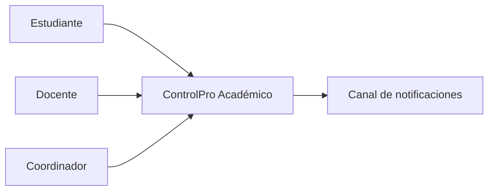
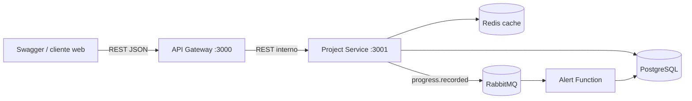
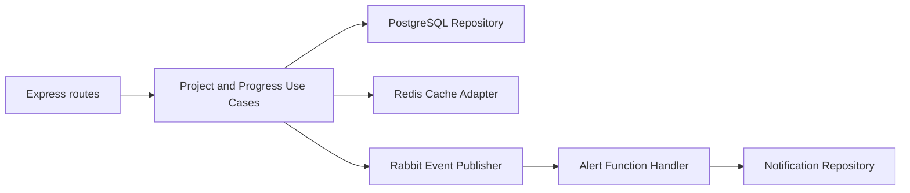
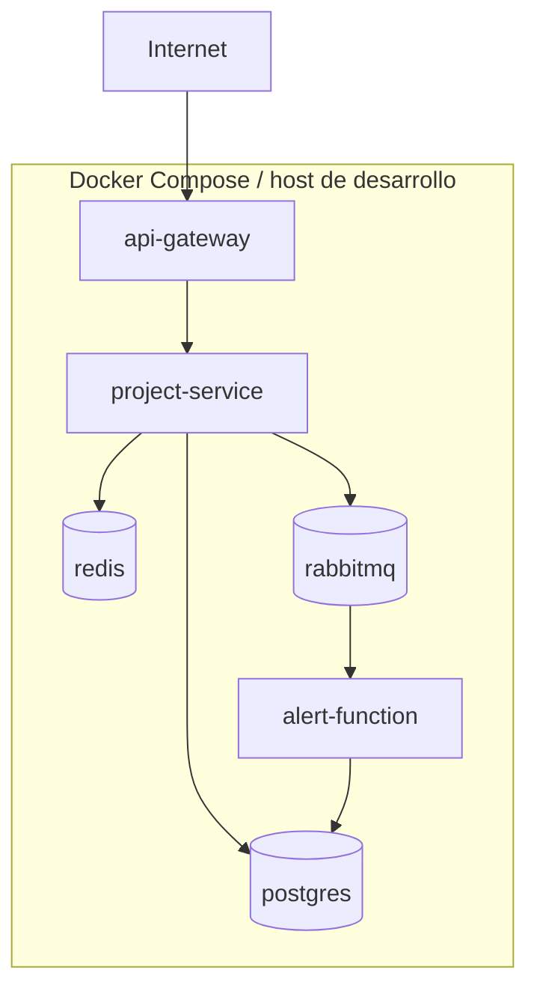

# Arquitectura de ControlPro Académico

## C4 — Contexto

```mermaid
flowchart LR
  estudiante[Estudiante] --> sistema[ControlPro Académico]
  docente[Docente] --> sistema
  coordinador[Coordinador] --> sistema
  sistema --> correo[Canal de notificaciones]
```

## C4 — Contenedores

```mermaid
flowchart LR
  cliente[Swagger / cliente web] -->|REST JSON| gateway[API Gateway :3000]
  gateway -->|REST interno| projects[Project Service :3001]
  projects --> postgres[(PostgreSQL)]
  projects --> redis[(Redis cache)]
  projects -->|progress.recorded| rabbit[(RabbitMQ)]
  rabbit --> alerts[Alert Function]
  alerts --> postgres
```

## C4 — Componentes

```mermaid
flowchart LR
  router[Express routes] --> usecase[Project and Progress Use Cases]
  usecase --> repository[PostgreSQL Repository]
  usecase --> cache[Redis Cache Adapter]
  usecase --> publisher[Rabbit Event Publisher]
  publisher --> handler[Alert Function Handler]
  handler --> notification[Notification Repository]
```

## Despliegue

```mermaid
flowchart TB
  subgraph Docker[Docker Compose / host de desarrollo]
    G[api-gateway]
    P[project-service]
    F[alert-function]
    DB[(postgres)]
    C[(redis)]
    Q[(rabbitmq)]
  end
  Internet --> G --> P
  P --> DB
  P --> C
  P --> Q --> F --> DB
```

